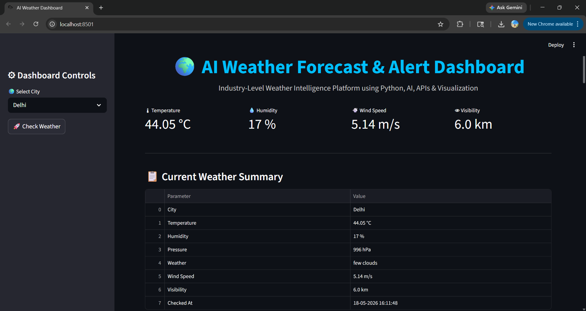
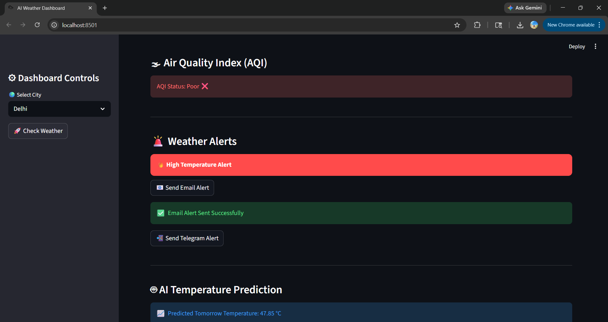
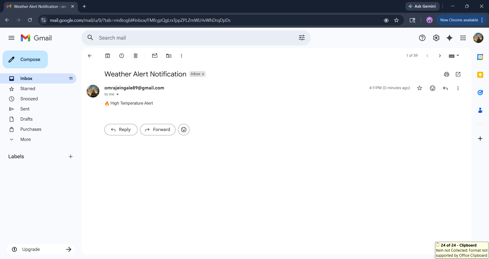
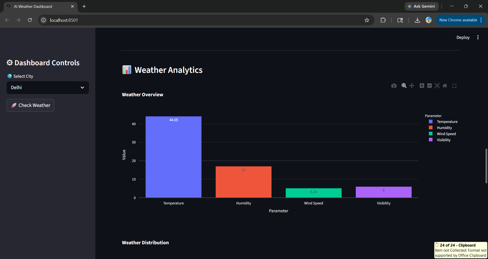
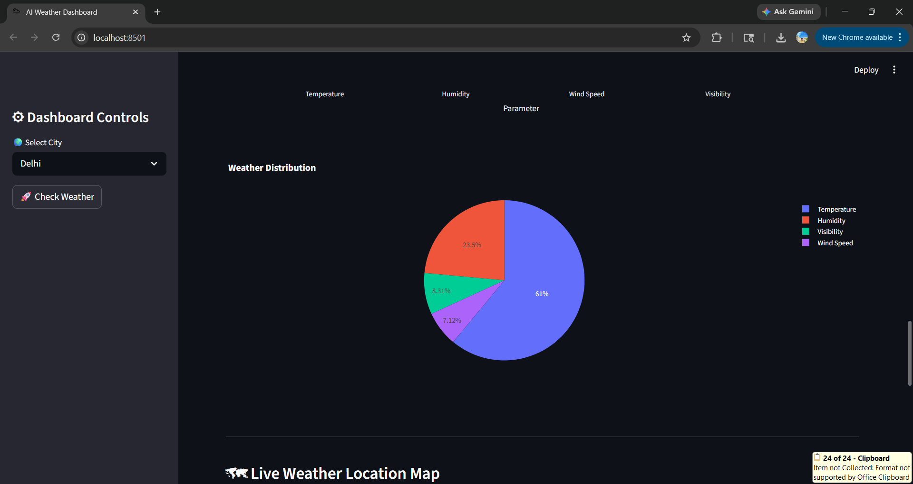
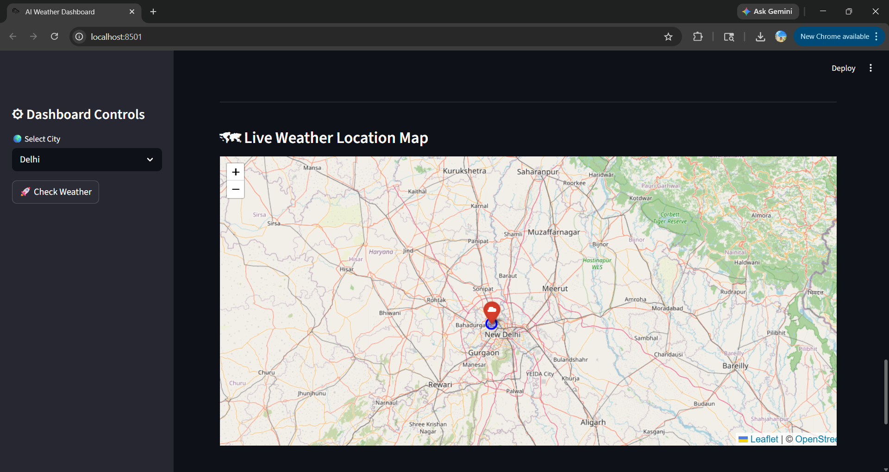

# 🌦 AI Weather Forecast & Alert Dashboard

<p align="center">


</p>

---

# 🚀 Project Overview

An **Advanced AI-Powered Weather Forecast & Alert Dashboard** built using **Python, Streamlit, FastAPI, Plotly, Folium, SQLite, and OpenWeather APIs**.

This project provides:

✅ Real-Time Weather Monitoring  
✅ 7-Day Forecast Analysis  
✅ AQI Monitoring  
✅ AI Temperature Prediction  
✅ Live Interactive Maps  
✅ Email & Telegram Alerts  
✅ FastAPI Backend Integration  
✅ Multi-City Dashboard  
✅ Analytics & Visualization  

The application is designed as an **industry-oriented weather intelligence platform** useful for:

- 🌍 Travelers
- 🚚 Logistics Companies
- 🌾 Agriculture
- ⚡ Energy Sector
- 🏢 Smart City Monitoring
- 📊 Data Analytics

---

# ✨ Dashboard Preview

## 🌍 Main Dashboard



---

## 🌫 AQI Monitoring





---

## 📊 Weather Analytics



---

## 🗺 Live Weather Map




---

# 🎯 Key Features

| Feature | Description |
|---|---|
| 🌡 Real-Time Weather | Live weather monitoring using OpenWeather API |
| 📅 7-Day Forecast | Future temperature and weather forecasting |
| 🤖 AI Prediction | Predicts future temperature using Machine Learning |
| 🌫 AQI Monitoring | Displays Air Quality Index |
| 📧 Email Alerts | Sends severe weather alerts via Email |
| 📲 Telegram Alerts | Real-time Telegram weather notifications |
| 🗺 Live Maps | Interactive city weather maps using Folium |
| 📊 Data Visualization | Plotly-powered analytics charts |
| 🗄 SQLite Database | Stores weather data locally |
| ⚡ FastAPI Backend | API support for scalability |

---

# 🛠 Tech Stack

## 👨‍💻 Languages & Frameworks

- Python 3.11
- Streamlit
- FastAPI
- SQLite

## 📊 Data Visualization

- Plotly
- Pandas
- Matplotlib

## 🌍 APIs

- OpenWeather API
- OpenWeather AQI API
- Telegram Bot API

## 🤖 AI / ML

- Scikit-Learn
- Linear Regression

## 🗺 Maps

- Folium
- Streamlit Folium

---

# 📂 Project Structure

```bash
AI-Weather-Forecast-Alert-Dashboard/
│
├── ai/
│   └── prediction.py
│
├── alerts/
│   ├── email_alert.py
│   └── telegram_alert.py
│
├── api/
│   └── app.py
│
├── data/
│   └── cities.json
│
├── database/
│   └── weather.db
│
├── images/
│
├── maps/
│   └── live_map.py
│
├── outputs/
├── reports/
├── screenshots/
│
├── dashboard.py
├── main.py
├── requirements.txt
├── .env.example
├── .gitignore
└── README.md
```

---

# ⚙ Installation Guide

## 1️⃣ Clone Repository

```bash
git clone https://github.com/yourusername/AI-Weather-Forecast-Alert-Dashboard.git
```

---

## 2️⃣ Open Project Folder

```bash
cd AI-Weather-Forecast-Alert-Dashboard
```

---

## 3️⃣ Create Virtual Environment

### Windows

```bash
python -m venv venv
venv\Scripts\activate
```

### Mac/Linux

```bash
python3 -m venv venv
source venv/bin/activate
```

---

## 4️⃣ Install Dependencies

```bash
pip install -r requirements.txt
```

---

# 🔑 Environment Variables

Create a `.env` file:

```env
API_KEY=YOUR_OPENWEATHER_API_KEY

EMAIL_ADDRESS=your_email@gmail.com
EMAIL_PASSWORD=your_app_password

TELEGRAM_BOT_TOKEN=your_bot_token
TELEGRAM_CHAT_ID=your_chat_id
```

---

# ▶ Run Streamlit Dashboard

```bash
streamlit run dashboard.py
```

---

# ⚡ Run FastAPI Backend

```bash
uvicorn api.app:app --reload
```

---

# 🌍 API Endpoint Example

```bash
http://127.0.0.1:8000/weather/Mumbai
```

---

# 📊 Sample Dashboard Modules

## 🌡 Weather Metrics

- Temperature
- Humidity
- Pressure
- Wind Speed
- Visibility

---

## 🚨 Alert System

- High Temperature Alerts
- Rain Alerts
- Wind Alerts
- AQI Warnings

---

## 🤖 AI Prediction

Predicts future temperature using:

- Linear Regression
- Historical Weather Pattern Simulation

---

## 🌫 AQI Monitoring

| AQI Level | Status |
|---|---|
| 1 | Good |
| 2 | Fair |
| 3 | Moderate |
| 4 | Poor |
| 5 | Very Poor |

---

# 📈 Future Enhancements

- 🌍 Live Radar Maps
- ☁ Cloud Deployment
- 📱 Mobile Application
- 🔔 Push Notifications
- 🛰 Satellite Weather Tracking
- 📡 IoT Weather Sensors
- 🌪 Disaster Prediction

---

# 🧠 Learning Outcomes

Through this project I learned:

✅ API Integration  
✅ AI Prediction Models  
✅ Data Visualization  
✅ Dashboard Development  
✅ FastAPI Backend Development  
✅ SQLite Database Handling  
✅ Streamlit Deployment  
✅ Git & GitHub Workflow  

---

# 💼 Industry Relevance

This project demonstrates skills required for:

- Python Developer
- AI/ML Engineer
- Data Analyst
- Automation Engineer
- Full Stack Developer
- Cloud Engineer
- Backend Developer

---

# 📸 Screenshots To Add

Create a folder:

```bash
screenshots/
```

Add screenshots:

- dashboard.png
- analytics.png
- map.png
- aqi.png

---

# 🔐 Security Best Practices

❌ Never upload:

- `.env`
- API Keys
- Passwords

✅ Use:

- `.env.example`
- `.gitignore`

---

# 👨‍💻 Author

## Om Ingale

### 🌟 Final Year Computer Engineering Student
### 🚀 Python | AI | Cloud | Full Stack Enthusiast

---

# ⭐ Support

If you like this project:

⭐ Star the repository  
🍴 Fork the project  
📢 Share on LinkedIn  

---

# 📬 Contact

📧 Email: omsingale2607@gmail.com

🌐 GitHub: https://github.com/omi-tech26

---

# 🏆 Project Status

✅ Completed  
✅ GitHub Ready  
✅ Recruiter Friendly  
✅ Portfolio Ready  
✅ Industry-Oriented  

---

<p align="center">

⭐ Thank You For Visiting This Repository ⭐

</p>